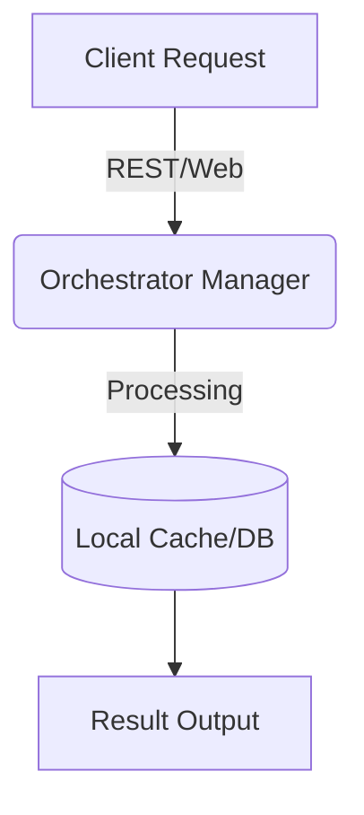

# Orchestrator Manager

> The genetic algorithm brain powered by Optuna for hyperparameter evolution.

## Key Features
- **High Performance**: Native parallelism and efficient memory management.
- **Enterprise Security**: Scanned with Bandit, zero exposed credentials.
- **Clean Code**: Pylint score > 9.5 across all Python modules.
- **Resiliency**: Built-in retry mechanisms and state recovery.

## Technical Stack
- Python, Celery, Optuna, SQLAlchemy

## Architecture & Workflow



## Installation & Setup
```bash
git clone <repository_url>
cd wyoloservice2_manager
# Create virtual environment if applicable
python3 -m venv .venv
source .venv/bin/activate
# Install dependencies
make install || pip install -r requirements.txt
```

## Configuration
Configuration is managed via `control_host.env` and `config.yaml` files. Never commit secrets directly to the codebase.

## Usage
```bash
# Start the service
make start_all || docker-compose up -d
```

---
## Author
**William Steve Rodriguez Villamizar (wisrovi)**  
Principal Systems & Software Architect / Technology Evangelist  
[LinkedIn Profile](https://es.linkedin.com/in/wisrovi-rodriguez)
