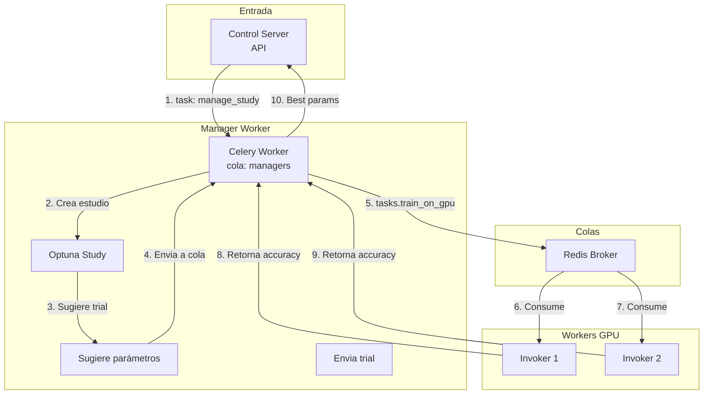
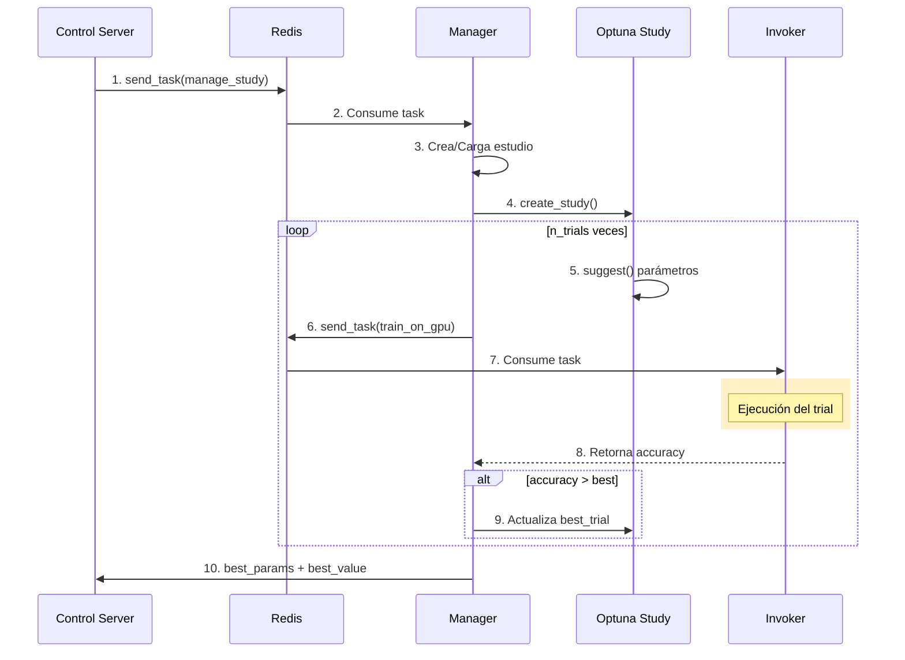
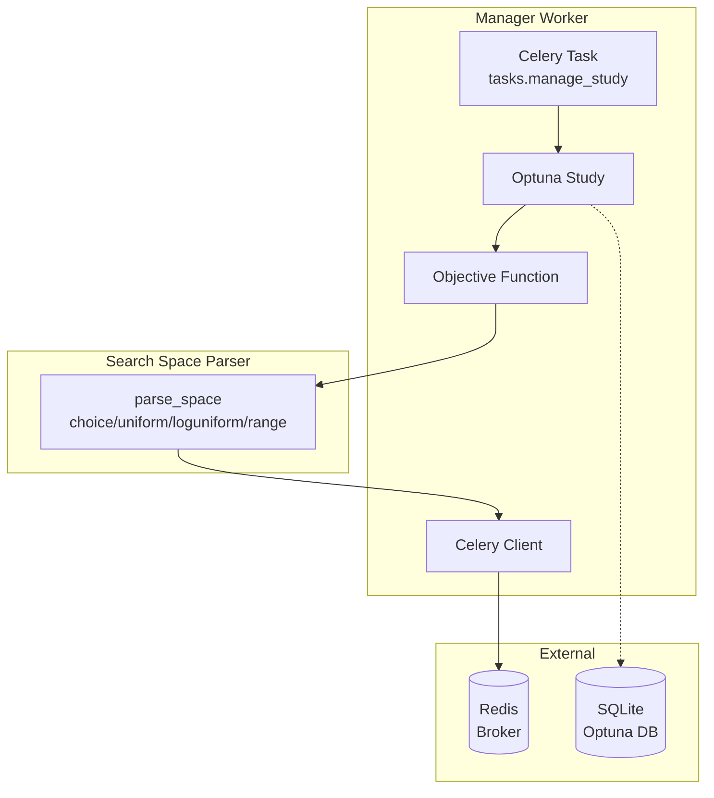

# Manager - Optuna Study Orchestrator

Este componente es el **orquestador central** del cluster. Coordina estudios de optimización de hiperparámetros usando **Optuna**, sugiriendo valores y dispatchando trials a los workers a través de Celery.

---

## 1. 🚶 Diagram Walkthrough



**Flujo Principal:**
1. Control Server envía task `manage_study` a la cola managers
2. Manager crea estudio Optuna (o carga existente)
3. Optuna sugiere hiperparámetros para el trial
4. Manager envía task `train_on_gpu` a la cola configurada
5. Invoker consume task, ejecuta entrenamiento
6. Retorna accuracy al Manager
7. Repite hasta completar n_trials
8. Retorna mejores parámetros

---

## 2. 🗺️ System Workflow



---

## 3. 🏗️ Architecture Components



### Componentes Clave

| Componente | Descripción |
|------------|-------------|
| **tasks.manage_study** | Tarea Celery principal que orquesta el estudio |
| **Optuna Study** | Estudio de optimización (crea/continúa) |
| **Objective Function** | Función que sugiere parámetros y evalúa trials |
| **parse_space** | Parser del search_space YAML a sugerencias Optuna |
| **Celery Client** | Envía tasks de entrenamiento a workers |

---

## 4. ⚙️ Container Lifecycle

### Build Process

1. **Base Image**: Python slim con Celery y Optuna
2. **Dependencies**: Instala `celery`, `optuna`, `pyyaml`, `redis`
3. **Code Copy**: Copia `user_orchestrator.py` y `celery_config.py`
4. **Entrypoint**: Configura comando Celery worker

### Runtime Process

1. **Redis Connection**: Conecta al broker configurado
2. **Celery Worker**: Inicia worker en cola `managers`
3. **Optuna Storage**: Crea/abre estudio en SQLite local
4. **Pool Solo**: Usa `-P solo` para evitar deadlock
5. **Listening**: Espera tareas de estudios

---

## 5. 📂 File-by-File Guide

| Archivo/Carpeta | Propósito |
|-----------------|-----------|
| `user_orchestrator.py` | Tarea Celery `manage_study` y lógica Optuna |
| `celery_config.py` | Configuración de Celery (colas, broker) |
| `__init__.py` | Inicialización del módulo |
| `config.yaml` | Configuración de ejemplo |
| `requirements.txt` | Dependencias Python |
| `Dockerfile` | Imagen del contenedor |

---

## Configuración

```yaml
manager:
  optuna:
    n_trials: 20
    study_name: "distributed_study"
    direction: "maximize"

celery:
  broker_url: "redis://192.168.10.252:23437/0"
  queues:
    manager: "managers"
    worker: "gpus"
```

### Espacio de Búsqueda

El Manager soporta estos tipos en el search_space:

```yaml
search_space:
  model: ["choice", "yolov8n", "yolo11s"]
  train.lr0: ["loguniform", 1e-5, 1e-2]
  train.imgsz: ["range", 320, 640, 32]
```

---

## Uso

```bash
# Iniciar Manager
celery -A user_orchestrator worker -Q managers --concurrency=1 -P solo
```

---

**William R.** - AI Leader & Solutions Architect
