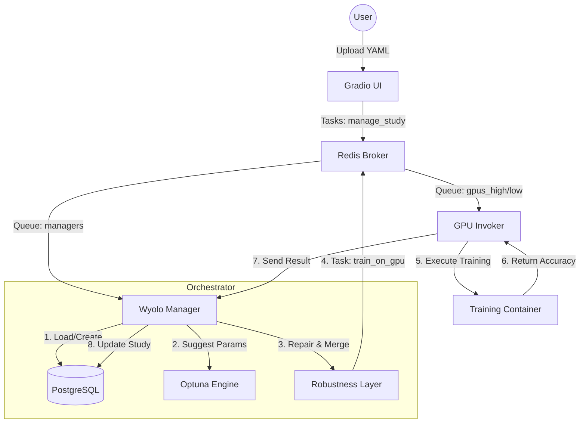

# Wyolo Manager - Optuna Study Orchestrator

This component is the **central orchestrator** of the AI cluster. It manages hyperparameter optimization studies using **Optuna**, ensuring that every training trial is dispatched correctly and results are persisted.

---

## 📊 System Architecture



---

## ✨ Key Features

- **🎯 Smart Orchestration**: Uses Optuna to find the best hyperparameters for your models.
- **🛡️ Extreme Robustness**: Automatically repairs missing fields in your configuration using a fail-safe default layer.
- **🗄️ Database Fallback**: If PostgreSQL is unavailable, it automatically switches to local SQLite to ensure continuity.
- **🔢 Type Safety**: Explicitly handles and casts hyperparameter types (floats, ints) from YAML to prevent Optuna type errors.
- **📈 Persistence**: Experiments are stored in PostgreSQL or SQLite fallback.
- **🚀 Flexible Routing**: Supports priority queues (`high`, `medium`, `low`) to manage cluster load.
- **🖥️ Monitoring**: Integrated logging that shows the exact payload sent to workers.

---

## 🧪 Testing and Validation

### Integration Test (Full Flow)
To test the Manager, Optuna, and Invoker connection:
1. Set the Redis IP: `export CONTROL_HOST=192.168.10.252`
2. Run: `python tests/send_to_manager_directly.py`

### Robustness Test (Broken Config)
To verify how the Manager repairs an incomplete YAML:
1. Run: `python tests/send_broken_to_manager.py`
2. Check logs: `docker logs wyolo_manager -f`

---

## 🛠️ Setup & Commands

| Command | Description |
| :--- | :--- |
| `make setup` | Initialize environment variables. |
| `make build` | Build Manager and UI Docker images. |
| `make up` | Start the orchestrator in the background. |
| `make logs` | Follow `wyolo_manager` logs in real-time. |
| `make down` | Stop all services. |

---

## ⚙️ Configuration Example

The manager can handle minimal configurations. It will automatically fill the rest:

```yaml
sweeper:
  study_name: "auto_optimized_exp"
  n_trials: 5
  priority: "high"
  search_space:
    train:
      lr0: ["loguniform", 1e-5, 1e-2]
```

---

**William R.** - AI Leader & Solutions Architect
