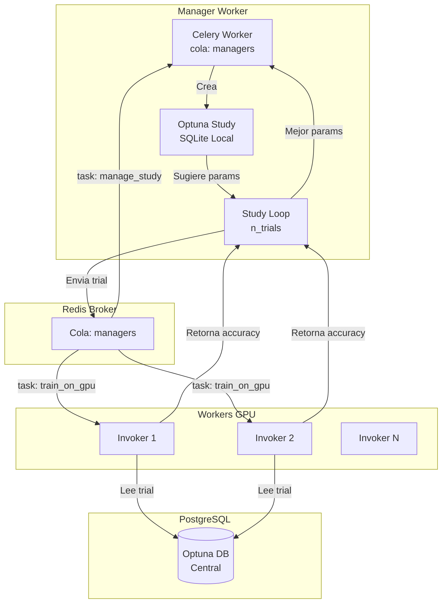
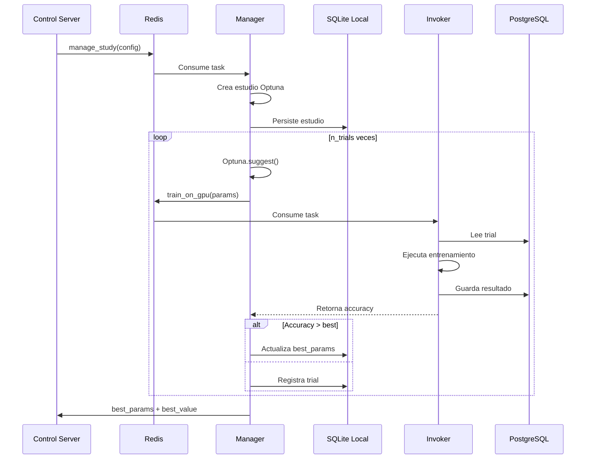

# Manager - Study Orchestrator (Orquestador de Estudios)

El Manager es el "cerebro" del cluster. Utiliza **Optuna** para orquestar la optimización distribuida de hiperparámetros.

## Arquitectura



## Operación

1.  **Ingestión**: Escucha la cola `managers` y recibe la configuración YAML completa parseada.
2.  **Inicialización del Estudio**: Crea o carga un estudio Optuna, usando una base de datos SQLite local para persistencia del estado.
3.  **Bucle de Optimización**: 
    *   Optuna sugiere un conjunto de hiperparámetros basado en el `search_space`.
    *   El Manager dispatcha una tarea `tasks.train_on_gpu` a la cola de workers especificada (`gpus_high/medium/low` o cola privada).
    *   **Bloqueo Controlado**: El Manager espera el resultado del worker vía un polling loop (`wait_for_result`). Esto asegura que los trials se procesen secuencialmente y previene que el orquestador se sobrecargue.
4.  **Completación**: Una vez que todos los trials terminan, retorna los mejores parámetros encontrados.

## Tarea Celery: tasks.manage_study



## Configuración (config.yaml)

```yaml
manager:
  optuna:
    n_trials: 20
    study_name: "distributed_study"
    direction: "maximize"

celery:
  broker_url: "redis://192.168.1.137:23437/0"
  result_backend: "redis://192.168.1.137:23437/0"
  queues:
    manager: "managers"
    worker: "gpus"
```

## ¿Por qué usar `-P solo`?

El Manager corre con el pool `solo` de Celery (`-P solo`). Esto es **crítico** porque permite que una tarea Celery (el estudio) espere el resultado de otras tareas (los trials) sin causar un deadlock, manteniendo la ejecución dentro de un único hilo de control para Optuna.

## Despliegue

```bash
# Docker Compose
docker-compose -f docker-compose.manager.yml up -d

# Comando directo
celery -A user_orchestrator worker -Q managers --concurrency=1 -P solo --loglevel=info
```

## Espacio de Búsqueda (search_space)

El Manager soporta múltiples tipos de distribuciones en el search_space:

```yaml
sweeper:
  search_space:
    # Selección categórica
    model: ["choice", "yolov8n-cls.pt", "yolo11s-cls.pt"]
    
    # Valor continuo (uniforme)
    train:
      lr0: ["uniform", 0.001, 0.01]
    
    # Valor continuo (logarítmico)
    train:
      lr0: ["loguniform", 1e-5, 1e-2]
    
    # Enteros con paso
    train:
      imgsz: ["range", 320, 640, 32]
```

---

**William R.** - AI Leader & Solutions Architect
