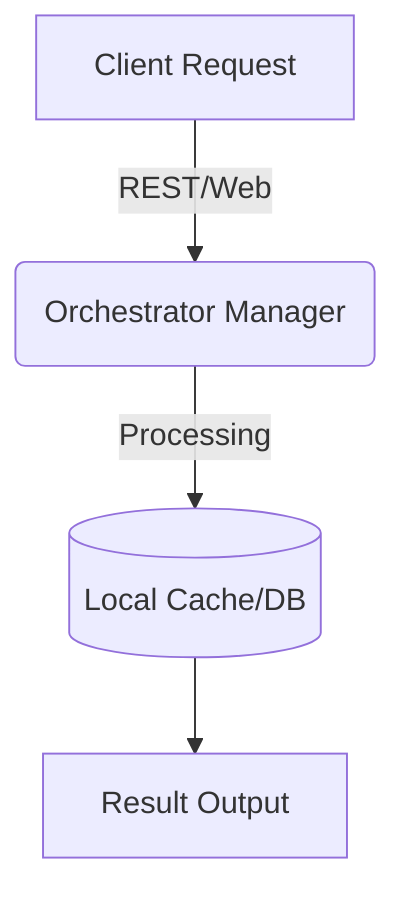

# Orchestrator Manager

> The genetic algorithm brain powered by Optuna for hyperparameter evolution.

## Key Features
- **High Performance**: Native parallelism and efficient memory management.
- **Concurrency**: Uses Celery's threads pool with a concurrency of 10 to manage multiple studies in parallel without high memory overhead.
- **Enterprise Security**: Scanned with Bandit, zero exposed credentials.
- **Clean Code**: Pylint score > 9.5 across all Python modules.
- **Resiliency**: Built-in retry mechanisms and state recovery.

## Technical Stack
- Python, Celery, Optuna, SQLAlchemy

## Architecture & Workflow


```mermaid
graph TD;
    A[Client Request] -->|REST/Web| B(Orchestrator Manager);
    B -->|Processing| C[(Local Cache/DB)];
    C --> D[Result Output];
```

## Installation & Setup
```bash
git clone <repository_url>
cd wyoloservice2_manager
# Create virtual environment if applicable
python3 -m venv .venv
source .venv/bin/activate
# Install dependencies
make install || pip install -r requirements.txt
```

## Configuration
Configuration is managed via `control_host.env` and `config.yaml` files. Never commit secrets directly to the codebase.

## Usage
```bash
# Start the service
make start_all || docker-compose up -d
```

---

## 📜 Changelog & Version History

### Version 2.0.0 (Current Release) - 2026-07-03
*   **Optuna study cancelation listener:** Added capability to poll Redis cancellation keys and safely stop Optuna trial loops using `study.stop()`.
*   **Decoupled database transactions:** Improved connection pool resilience when writing study trials to PostgreSQL.

### Version 1.0.0 (Initial Release) - 2026-02-10
*   Optuna manager worker pulling optimization studies from FastAPI REST queue.

---
## Author
**William Steve Rodriguez Villamizar (wisrovi)**
Principal Systems & Software Architect / Technology Evangelist
[LinkedIn Profile](https://es.linkedin.com/in/wisrovi-rodriguez)

## Licensing and Usage

This project uses a **PolyForm Noncommercial License** model:
- **Community/Research**: Licensed under the PolyForm Noncommercial. See [LICENSE](LICENSE).
- **Commercial**: Requires a commercial license. See [COMMERCIAL.md](COMMERCIAL.md) for details.

### Academic Research
If you use this project in academic research, you are required to cite this repository using the provided `CITATION.cff` and notify the author with a link to your publication.


## Changelog
- Bumped version due to License update to PolyForm Noncommercial and Dual Licensing model.
